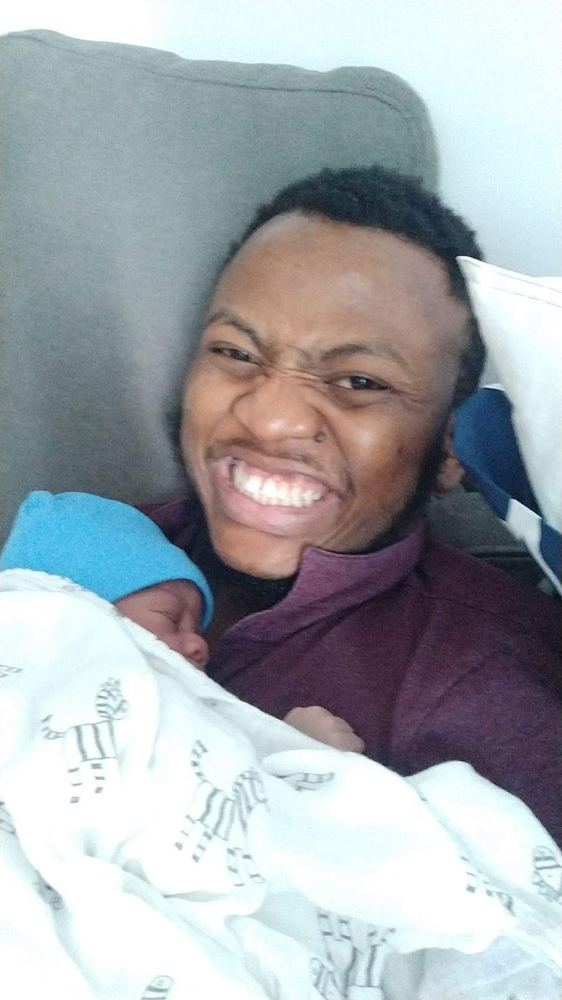

ADH confuses me a whole lot for someone well travelled. I have come to expect that, for someone who spent the first 5 months of his conception in hippy Berlin, 4 months in Toronto and still managed to slip in 2 trips to Nigeria in between, he’d have a decent understanding of how the world works. He expects the entire world to revolve around him. He’s probably right.

It’s been 5 days since I became a father in the early hours of Thursday morning. I know it’s cliche, but he’s been the next best thing to happen to me after Yettie. We’d been preparing for his arrival the past couple of months. I am especially grateful to our Doctors from Berlin, here in Toronto and all the health-care professionals who helped facilitate a smooth pregnancy and delivery. I felt a waft of cold air across my face as soon as his head popped through the birth canal. I shed a tear as I kissed his mom on the head, reassuring her that he’s almost here and  that we needed extra strength from her to push the rest of him out. Our lives changed forever as his screams rang through the room announcing his arrival.

I have had the full spectrum of feelings in the past five days, from excitement, frustration, confusion, happiness. Our friend’s and families have been extremely supportive. P.S. I think I have the best friends in the whole world, I wouldn't swap them for anything. They have listened to me rant about my feelings. It was in one of those sessions with Oyewumi, that she suggested I write about my experience. I’ll try to do that whenever ADH decides to give me enough time to catch my breath.

I had read some books in preparation for ADH’s arrival, but I seemed to underestimate how frustrated I’d be when he’d wake up every other hour apparently demanding to be fed. I’d always cherished my bedtime, but now and the next couple of months (or years?), it seems I am now at the mercy of ADH.

The standout experience has been getting him to sleep. I got confused when after lulling him to sleep and dropping him off in his sleeping bassinet he’d spontaneously jerk and wake up with his high pitched scream. Wait, was he planning to spend his whole bedtime on my chest? Surely, that can’t be. He spent his first night alternating between my chest and Yettie’s arms. There must be an art to this sleep thing, or science as I have now started to discover.

The determination to be the best father pushes me to understand him, provide him a conducive home, and help him lead a healthy life. This in turn drives me to fill the huge knowledge gap I have about the world of babies. I hope to write about my journey, document my experience and share my learnings here.

He’s not going to be called ADH for long, we have finally decided on his name. As a software engineer, I have always known that naming things was not trivial, but naming your first child as a Yoruba man is one hell of a task. As part of our culture, a child’s christening is done on the 8th day and we’d be sharing his names with friend’s and family then. I’ll definitely be sharing the name selection process in my next post.

Until I find the mental space to write my next post, I’ll be at ADH’s service.

